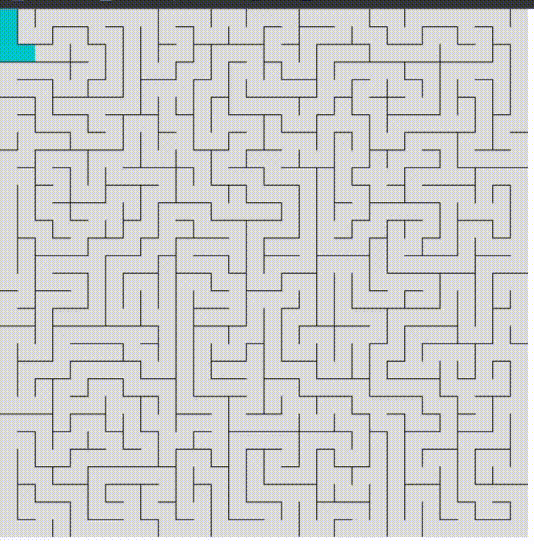
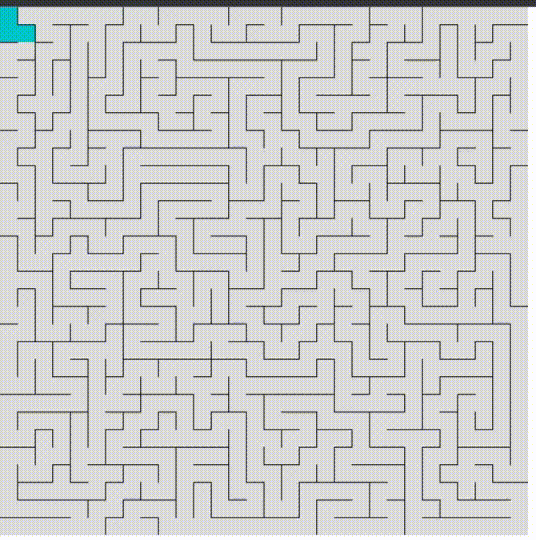

# Gerador e Solucionador de Labirinto usando Dijkstra

Este projeto implementa um gerador de labirinto e um solucionador usando o algoritmo de Dijkstra. Feito com o uso do p5.js, ele cria labirintos e encontra o caminho mais curto através deles.

## Exemplos

<br/>
<br/>
<br/>

## Para executar o gerador de labirinto:

1. **Clone o repositório**

   ```bash
   git clone https://github.com/maaure/gerador-labirinto.git
   ```

2. **Instale as dependências**

   Vá para o diretório do projeto e execute:

   ```bash
   npm install
   ```

3. **Inicie o servidor de desenvolvimento**

   Use o comando:

   ```bash
   npm run dev
   ```

4. **Visualize o gerador de labirinto**

   Abra seu navegador e acesse `http://localhost:8080` (ou a porta indicada no terminal).

## Contribuições

Contribuições são bem-vindas! Sinta-se à vontade para propor melhorias ou correções de bugs.

## Autor

Desenvolvido por Maure Andrade.
